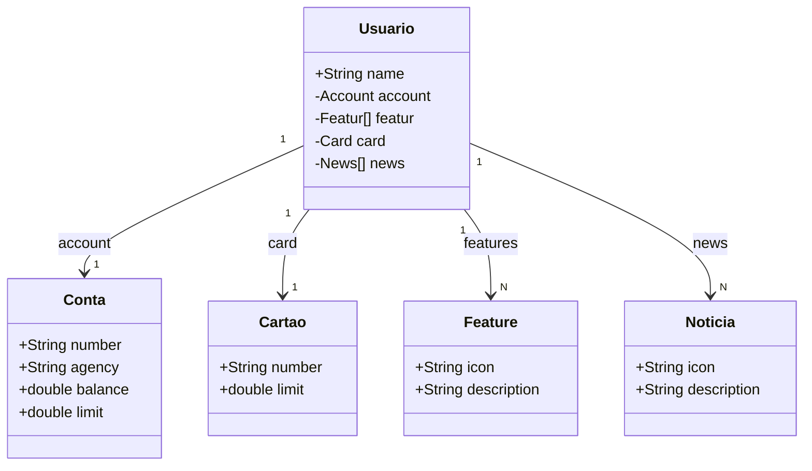

# Santander Dev Week
Java REDTful API criada para a Santander Dev Week

##Diagrama de Classe

```mermaid

classDiagram
    class Usuario {
        +String name
        -Account account
        -Featur[] featur
        -Card card
        -News[] news
    }

    class Conta {
        +String number
        +String agency
        +double balance
        +double limit
    }

    class Feature {
        +String icon
        +String description
    }

    class Cartao {
        +String number
        +double limit
    }

    class Noticia {
        +String icon
        +String description
    }

    Usuario "1" --> "1" Conta : account
    Usuario "1" --> "1" Cartao : card
    Usuario "1" --> "N" Feature : features
    Usuario "1" --> "N" Noticia : news

```
